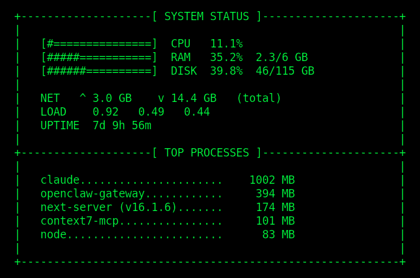

# vpsmon

A fast, zero-dependency VPS system monitor written in **Zig**. Reads metrics directly from `/proc/` and renders a hacker-style ASCII dashboard.

**The main purpose of this tool is to send a visual image of your system status instead of a plain text message.** It generates a PNG image with green-on-black terminal aesthetics — perfect for Telegram, WhatsApp, or Discord bot integrations.



## Features

- **CPU** usage with visual bar
- **RAM** usage (used / total)
- **Disk** usage (used / total)
- **Network** traffic (total RX/TX)
- **Load** average (1/5/15 min)
- **Uptime** (days, hours, minutes)
- **Top 5 processes** by memory usage (user-space only, no kernel threads)
- **PNG rendering** via ImageMagick/Pango — hacker green (`#00FF41`) on black
- **Telegram integration** — one-command render + send via Bot API

## Requirements

### Build
- [Zig](https://ziglang.org/download/) >= 0.13.0

### Image rendering (optional)
- [ImageMagick](https://imagemagick.org/) with Pango support
- A monospace font (e.g. DejaVu Sans Mono)

```bash
# Ubuntu/Debian
sudo apt install imagemagick fonts-dejavu-core

# Arch
sudo pacman -S imagemagick ttf-dejavu
```

## Build

```bash
git clone https://github.com/burnshall-ui/vpsmon.git
cd vpsmon

# Debug build
zig build

# Optimized release build
zig build -Doptimize=ReleaseFast

# Run directly
zig build run
```

The binary is at `zig-out/bin/vpsmon` (~1.4 MB release build, statically linked).

### Install to PATH

```bash
cp zig-out/bin/vpsmon ~/.local/bin/
```

## Usage

### Terminal output
```bash
vpsmon
```

```
+--------------------[ SYSTEM STATUS ]---------------------+
|                                                          |
|   [####============]  CPU   25.3%                        |
|   [######==========]  RAM   38.1%  8.8/23 GB             |
|   [######==========]  DISK  39.8%  46/115 GB             |
|                                                          |
|   NET   ^ 2.9 GB    v 14.3 GB   (total)                  |
|   LOAD    0.76   0.63   0.51                             |
|   UPTIME  7d 9h 6m                                       |
|                                                          |
+--------------------[ TOP PROCESSES ]---------------------+
|                                                          |
|   openclaw-gateway............     394 MB                |
|   next-server (v16.1.6).......     174 MB                |
|   node........................      83 MB                |
|   python3.....................      42 MB                 |
|   redis-server................      12 MB                |
|                                                          |
+----------------------------------------------------------+
```

### Render as PNG
```bash
./render.sh /tmp/vpsmon.png
```

### Send via Telegram
```bash
# 1. Copy and configure
cp send_status.sh.example send_status.sh
# Edit send_status.sh — set BOT_TOKEN and CHAT_ID

# 2. Run
./send_status.sh
```

## OpenClaw Integration

vpsmon ships with an [OpenClaw](https://openclaw.ai) skill definition. To use it:

1. Copy `SKILL.md` to your OpenClaw workspace skills directory:
   ```bash
   mkdir -p ~/.openclaw/workspace/skills/vpsmon
   cp SKILL.md ~/.openclaw/workspace/skills/vpsmon/SKILL.md
   ```

2. Add exec approval for your agent:
   ```bash
   openclaw approvals allowlist add --agent main "/path/to/vpsmon/send_status.sh"
   ```

3. Add to your agent's `SOUL.md`:
   ```markdown
   ## VPS-Monitoring (vpsmon)
   When the user asks about system status, run `/path/to/vpsmon/send_status.sh`.
   Respond with "SYSTEM STATUS" only — the script sends the image via Telegram.
   ```

4. Restart the gateway and ask your agent: *"How's the server doing?"*

## Project Structure

```
vpsmon/
├── src/
│   └── main.zig          # Core monitor — reads /proc/, outputs ASCII
├── render.sh              # Renders ASCII to PNG via ImageMagick/Pango
├── send_status.sh.example # Template: render + send via Telegram
├── SKILL.md               # OpenClaw agent skill definition
├── assets/
│   └── screenshot.png     # Example output
├── build.zig              # Zig build configuration
├── build.zig.zon          # Zig package manifest
├── LICENSE                # MIT
└── README.md
```

## How it works

vpsmon reads Linux system metrics directly from the `/proc` filesystem:

| Metric | Source |
|--------|--------|
| CPU | `/proc/stat` |
| Memory | `/proc/meminfo` |
| Disk | `statfs("/")` |
| Network | `/proc/net/dev` |
| Load | `/proc/loadavg` |
| Uptime | `/proc/uptime` |
| Processes | `/proc/[pid]/stat` + `/proc/[pid]/cmdline` |


Image rendering uses ImageMagick's Pango backend for proper monospace font rendering with UTF-8 support.

## License

MIT
